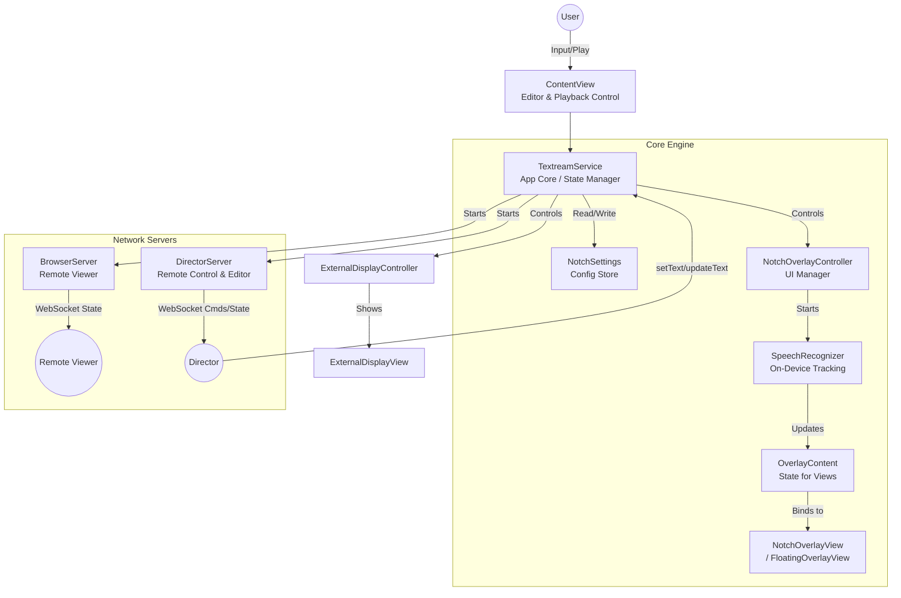

# Textream 架构与功能设计文档

## 架构概览 (Architecture Overview)

---

## 1. 核心工作模式 (Working Modes)

Textream 的核心目标是作为一款隐形的提词器，它有三个主要的功能维度，相互独立又可以组合使用：

### 1.1 提词引导模式 (Listening/Guidance Modes)
决定文本如何随时间推进（基于 `SpeechRecognizer` 或 `Timer`）：
- **Word Tracking (语音追踪)**: 默认模式。使用端侧 `SFSpeechRecognizer` 识别用户语音，实时高亮当前读到的单词。
- **Classic (经典模式)**: 定速自动滚动，不需要麦克风。
- **Voice-Activated (声控模式)**: 当检测到用户说话（有音量/语音输入）时滚动，停顿时暂停滚动，适合自然的阅读节奏。

### 1.2 悬浮窗显示模式 (Overlay Modes)
决定提词器在屏幕上的物理形态（通过 `NotchOverlayController` 实现）：
- **Pinned to Notch (刘海屏吸附)**: 以类似灵动岛的形式挂在屏幕正上方，处于系统最顶层。
  - *子模式*: Follow Mouse (跟随鼠标所在屏幕) / Fixed Display (固定在特定屏幕)。
- **Floating Window (独立悬浮窗)**: 可自由拖拽的窗口。
  - *子模式*: Follow Cursor (紧随鼠标指针，附带快速停止按钮) / Glass Effect (毛玻璃背景)。
- **Fullscreen (全屏模式)**: 在选定屏幕（如外接显示器或 Sidecar iPad）上全屏显示，按 Esc 退出。

### 1.3 外部与远程协作模式 (External & Remote Modes)
- **External Display (外接显示输出)**: 支持将提词内容直接输出到扩展屏幕。支持 Mirror（镜像翻转，供物理提词机使用）。
- **Remote Connection (局域网远程查看)**: 开启本地 HTTP+WebSocket 服务器，通过手机扫码（浏览器）实时同步查看提词进度。
- **Director Mode (导播控制模式)**: 开启专用的控制端 Web UI。导播可以在浏览器端实时修改、推送脚本文本，控制端强制进入 Word Tracking 模式。

---

## 2. 配置树状分布结构 (Settings Tree)

配置页面 (`SettingsView.swift` & `NotchSettings.swift`) 采用分类标签页设计，功能分布极其清晰。后续新增功能可以根据此树状结构对号入座：

- 🎨 **Appearance (外观设置)**
  - **Font (字体)**: Sans, Serif, Mono, Dyslexia (防阅读障碍)
  - **Size (字号)**: XS, SM, LG, XL
  - **Highlight Color (高亮颜色)**: 提词高亮字体的颜色 (6种预设)
  - **Cue Color & Brightness (提示词颜色与亮度)**: 提示词未读/已读状态的透明度控制
  - **Dimensions (窗口尺寸)**: 可调节提词器悬浮窗的 Width (宽度) 与 Height (高度)

- 🎙️ **Guidance (引导与识别设置)**
  - **模式选择**: Word Tracking / Classic / Voice-Activated
  - **Speech Language (识别语言)**: 仅 Tracking 模式有效
  - **Microphone (麦克风选择)**: 选择收音设备
  - **Scroll Speed (滚动速度)**: 0.5–8 words/s (仅 Classic/Voice 模式有效)

- 💻 **Teleprompter (提词器窗口设置)**
  - **模式选择**: Pinned / Floating / Fullscreen
  - **(针对 Pinned) Display Mode**: 跟随鼠标 vs 固定显示器
  - **(针对 Floating) Options**: 跟随光标 (Follow Cursor), 毛玻璃效果及透明度 (Glass Effect)
  - **(针对 Fullscreen) Display**: 选择全屏目标显示器
  - **Other Options**:
    - **Elapsed Time**: 开启/关闭录制计时器
    - **Hide from Screen Share**: 是否在屏幕共享/录屏中隐藏 (底层通过 `NSPanel.sharingType` 实现)
  - **Pagination (分页控制)**:
    - Auto Next Page (自动翻页) 及倒计时设定 (3s/5s)

- 🖥️ **External (外部屏幕设置)**
  - **模式选择**: Off / Teleprompter / Mirror
  - **Mirror Axis (镜像轴)**: 水平 (Horizontal) / 垂直 (Vertical) / 均翻转 (Both)
  - **Target Display**: 选择外接显示器

- 🌐 **Remote (远程同步设置)**
  - **开关**: Enable Remote Connection
  - **扫码与信息**: 展示当前局域网 IP 与二维码
  - **Advanced**: 自定义 HTTP 和 WebSocket 的端口 (默认 7373)

- 🎬 **Director (导播模式设置)**
  - **开关**: Enable Director Mode
  - **扫码与信息**: 控制端 URL 链接及二维码
  - **Advanced**: 自定义端口 (默认 7575)

---

## 3. 核心结构逻辑与工作流 (Architecture & Data Flow)

### 3.1 文本与分页管理 (Text & Pagination)
- **管理器**: `TextreamService` (单例) 是整个应用的控制中枢。
- **数据结构**: `pages: [String]` 存储多页文本。`currentPageIndex` 记录当前页。
- **导入导出**: 支持将文本保存为 `.textream` (JSON数组) 格式，或拖入 `.pptx` 解析演讲者备注 (`PresentationNotesExtractor.swift`)。

### 3.2 识别与高亮控制流 (Tracking Flow)
1. 用户在 `ContentView` 的富文本编辑器输入文本并点击播放 (Play)。
2. `TextreamService.readText()` 被调用，隐藏主窗口，唤起 `NotchOverlayController`。
3. `NotchOverlayController` 根据设定初始化对应的 `NSPanel` (Pinned / Floating / Fullscreen)。
4. `SpeechRecognizer` 被启动，传入当前页文本。它将文本拆分为单词数组。
5. 当用户说话时，`SpeechRecognizer` 通过苹果内置 API 返回识别出的最新文本，并根据匹配算法更新 `recognizedCharCount`（已读字符数）。
6. UI 组件 (`MarqueeTextView` / `SpeechScrollView`) 监听此 Count，实时改变文本的高亮位置以及滚动偏移量。

### 3.3 网络同步流 (WebSocket Sync Flow)
- Textream 包含了两个微型服务器：`BrowserServer` 和 `DirectorServer`。
- **App -> 浏览器 (状态广播)**: 以约 10Hz 频率广播 JSON 状态，包含：当前单词数组 `words`、高亮字符数 `highlightedCharCount`、波形图数据 `audioLevels` 等。
- **导播浏览器 -> App (控制指令)**:
  - `setText`: 强制 App 覆盖当前内容并直接启动提词。
  - `updateText`: 在不丢失阅读进度的情况下，实时替换后面还未阅读的脚本内容。
  - `stop`: 遥控停止提词。
